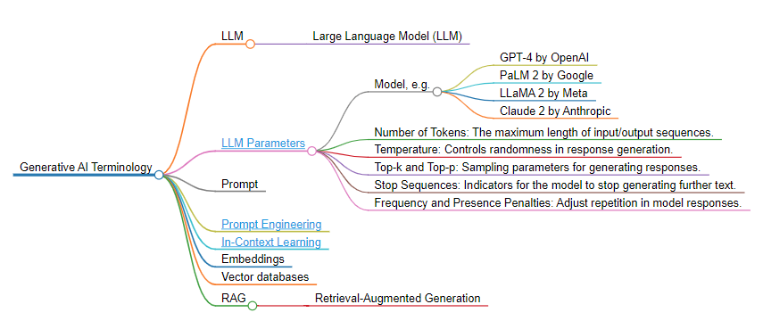
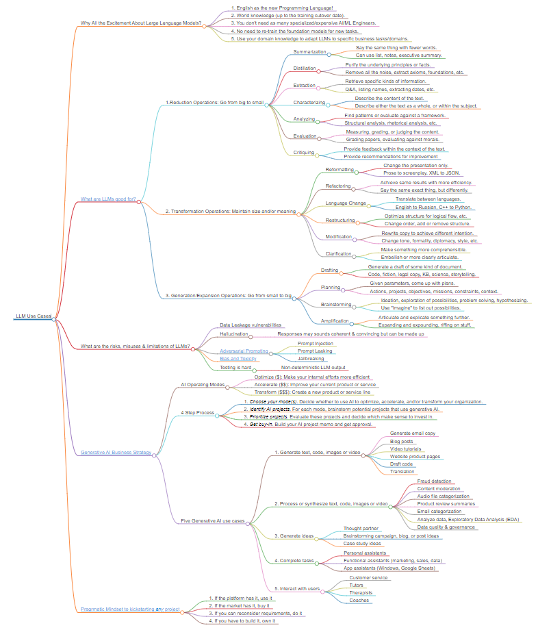
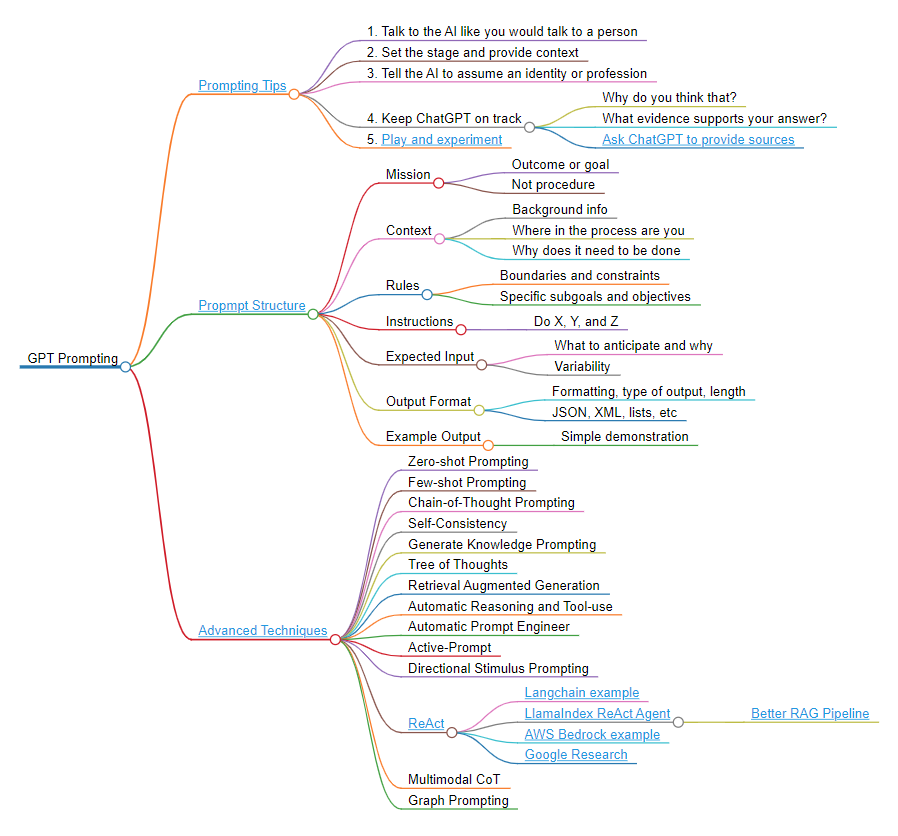

# Generative AI Mind Maps

Welcome to the Generative AI Mind Maps repository! This repo is dedicated to exploring the fascinating world of Generative AI, focusing on best practices, diverse use cases, and pragmatic approaches for adopting LLMs (Large Language Models) into businesses. Here, you'll find insightful MindMaps, formatted using [Markmap](https://markmap.js.org/) to transform markdown files into interactive mind maps.

Navigate the maze of Generative AI, a realm brimming with information. This repository helps you discern the valuable insights amidst the overwhelming sea of noise, guiding you to quality knowledge and away from common misconceptions.

## What You'll Find in This Repository

Designed to help businesses adopt AI in a practical, efficient, and cost-effective manner, these Mindmaps, emphasizing a Serverless/Pragmatic Mindset, will guide you through the maze of possibilities when integrating Generative AI into your business processes.

### Basic Generative AI Terminology

Grasping the key terms and concepts in Generative AI is essential, and fortunately, they're quite manageable to get familiar with:

For interactive visualization, either open the [SVG file](https://raw.githubusercontent.com/dzivkovi/Generative-AI-Mind-Maps/main/assets/Generative_AI_Terminology.svg) directly or paste the content of the [Generative_AI_Terminology.md](Generative_AI_Terminology.md) file into the [Markmap Interactive Viewer](https://markmap.js.org/repl).

### Pragmatic Approaches to GenAI Adoption w/ LLM Use Cases

Explore the diverse capabilities of Large Language Models as a springboard for imagination. This approach not only teaches you how to identify and tailor use cases to your specific domain or industry needs, but also emphasizes the potential of LLMs as a catalyst for innovative thinking, guiding you to discover relevant and impactful applications in your own field.

For interactive visualization, either open the [SVG file](https://raw.githubusercontent.com/dzivkovi/Generative-AI-Mind-Maps/main/assets/Large_Language_Model_Use_Cases.svg) directly or paste the content of the [Large_Language_Model_Use_Cases.md](Large_Language_Model_Use_Cases.md) file into the [Markmap Interactive Viewer](https://markmap.js.org/repl).

### GPT Prompting Advice

Uncover essential insights and best practices for effectively navigating through the 'sea of noise,' particularly in prompting, conversing with, or 'interviewing' Large Language Models, to get the most out of these models in the realm of Generative AI:

For interactive visualization, either open the [SVG file](https://raw.githubusercontent.com/dzivkovi/Generative-AI-Mind-Maps/main/assets/GPT_Prompting_Advice.svg) directly or paste the content of the [GPT_Prompting_Advice.md](GPT_Prompting_Advice.md) file into the [Markmap Interactive Viewer](https://markmap.js.org/repl).

## Contributing to the Repository

We welcome and appreciate contributions from the community, especially those that provide new insights, mind maps, or resources related to Generative AI. If you're interested in contributing, please follow these steps:

- Fork the repository.
- Add or edit the content in your fork.
- Submit a pull request with a clear description of your changes.

---

Join us in exploring the dynamic and ever-evolving landscape of Generative AI. Your contributions and feedback are invaluable in making this a comprehensive and useful resource for everyone interested in the field of AI.

[Back to Top](#generative-ai-mind-maps)
